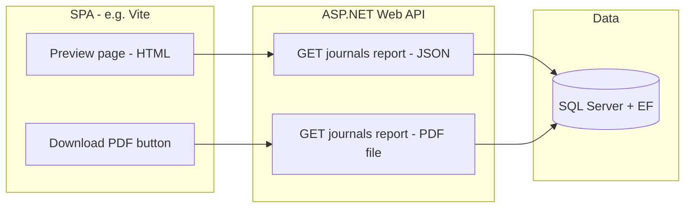

# Journal Invoice PDF & On-Site Preview — Implementation Plan

This document describes a feature to **filter journal entries by date range**, **show them in a print-style layout in the browser** (no automatic download), **download the same content as a PDF** on demand, and **surface which parties belong to each journal** (see § Data model note).

---

## 1. Goals

| Goal | Description |
|------|-------------|
| **Date-range filter** | User selects **from date** and **to date**; only journals whose header date falls in that range are included. |
| **PDF download** | A button generates and downloads a **single PDF** (or one PDF per journal — to be decided) containing the same logical content as the preview. |
| **On-site list / preview** | A **web page** in the SPA shows the journal entries in a layout **aligned with the PDF** (same columns, grouping, totals). **No** file download when opening this page. |
| **Parties per journal** | The document clearly lists **which parties** are associated with each journal (see § 2). |

---

## 2. Data model note — “Parties”

Today, `JournalDetail` has `AccCode`, `Debit`, `Credit`, `LineNarration`, and `Part` (a `short`, likely a **line/part sequence**, not a named party).

**Options (pick one in implementation):**

- **A — Minimal (no DB change):** Treat “parties” as **distinct account codes and/or line narrations** on that journal’s lines (grouped for display). Fast to ship; may be enough if accounts map 1:1 to counter-parties in your chart of accounts.
- **B — Explicit parties:** Add a `Party` (or `Counterparty`) entity and optional `PartyId` on `JournalDetail` (or a junction table), then show resolved **party names** in PDF and preview.

**Recommendation:** Start with **A** for the first iteration if product accepts it; add **B** when you need formal master data for parties.

---

## 3. High-level architecture

- **Preview page:** Calls a **JSON API** (same filters as PDF). Renders tables with CSS (print-friendly optional).
- **Download:** Calls a **PDF endpoint** that uses the **same query and mapping** as the JSON endpoint to avoid drift between “what you see” and “what you download.”

---

## 4. Backend (ASP.NET Core)

### 4.1 Shared reporting use case

- Add something like `IJournalReportService` (or methods on `IJournalService`) that:
  - Accepts **`fromDate`**, **`toDate`**, and uses **`ITenantProvider`** so results stay tenant-scoped (consistent with existing global filters).
  - Returns a **single DTO graph**, e.g. `JournalReportResult`:
    - List of **journals** in range (ordered by date, then voucher no).
    - For each journal: header fields + **details** + **derived “parties” section** (per § 2).
  - Optionally includes **per-journal debit/credit totals** and **grand totals** for the range.

### 4.2 API endpoints

| Method | Route (example) | Purpose |
|--------|------------------|---------|
| `GET` | `api/journal/report?from=...&to=...` | **JSON** for the preview page. |
| `GET` | `api/journal/report/pdf?from=...&to=...` | **PDF file** (`Content-Disposition: attachment`) for download. |

**Query validation:** `fromDate <= toDate`; return `400` if invalid. Empty range returns empty list / empty PDF with a clear title.

**Auth:** Same as existing journal APIs — **`[Authorize]`** so `TenantProvider` resolves `appUserID`.

### 4.3 PDF generation library

- Add a maintained .NET PDF library, e.g. **QuestPDF** (MIT, fluent API) or **ClosedXML + export** (if you prefer Excel first — not requested here).
- Implement a **single PDF builder** class that takes `JournalReportResult` and produces bytes/stream. **Do not** duplicate business rules inside the PDF layer—only layout.

### 4.4 Performance & limits

- For large ranges, consider **pagination** on the JSON endpoint only, or a **max date span** (e.g. 1 year) with a clear error message.
- PDF: if the document could be huge, consider **streaming** or **splitting by month** (product decision).

### 4.5 Files / projects (expected touch points)

- `Crud_App_dotNetApplication` — DTOs, `IJournalReportService`, report service implementation.
- `Crud_App_dotNetWebAPIApp` — new controller actions or extension of `JournalController`.
- `Crud_App_dotNetApplication.csproj` — PDF package reference.

---

## 5. Frontend (website — not in this repo unless you add it)

Assuming the existing **Vite** app (CORS already allows `localhost:5173`):

### 5.1 Preview route

- New route, e.g. `/journal-invoice-report` or `/reports/journal-invoice`.
- **Date pickers:** From / To, **Apply** triggers `GET .../report?from=&to=`.
- **UI:** Tables mirroring PDF sections (per journal: header, lines, parties block, subtotals). Use the **same column order** as the PDF template.
- **No** `window.open` to a PDF URL on load — only **HTML rendering** from JSON.

### 5.2 Download button

- **Download PDF** calls `GET .../report/pdf?from=&to=` with same dates (or opens in new tab only if you must; prefer **blob download** from `fetch` + `Content-Disposition` filename).

### 5.3 Styling

- Optional: `@media print` so **browser Print** also looks acceptable (extra; PDF remains the canonical export).

---

## 6. Consistency between preview and PDF

- **Single source of truth:** One service builds `JournalReportResult`; JSON and PDF both consume it.
- **Snapshot tests** (optional): Golden JSON for a fixed seed dataset to catch accidental field changes.

---

## 7. Testing checklist

- **Tenant isolation:** User A never sees User B’s journals in report or PDF.
- **Date boundaries:** Inclusive/exclusive rules documented (recommend **inclusive** both ends in local date or UTC — align with how `VoucherDate` is stored).
- **Empty range:** Empty table + message, PDF still valid.
- **Large number of lines:** Layout does not break (PDF pagination).

---

## 8. Out of scope (unless you add later)

- Email delivery of PDF.
- Async “generate report in background” + notification.
- Multi-currency (if not on `Journal` today).

---

## 9. Open decisions for your approval

1. **Parties:** Option **A** (derive from lines) vs **B** (new `Party` master) — confirm before coding.
2. **One PDF vs many:** One file for the whole range vs one PDF per journal (zip).
3. **Where the SPA lives:** Confirm repo/path for the Vite app if implementation should include UI in the same sprint.

---

## 10. Suggested implementation order

1. DTO + `IJournalReportService` + repository/query for date range (tenant-safe).
2. `GET .../report` JSON + minimal SPA preview page.
3. PDF builder + `GET .../report/pdf` + Download button wired to same dates.
4. Polish: totals, headers/footers (company name placeholder), error handling, limits.

---

*Document version: 1.0 — for review and approval before implementation.*
